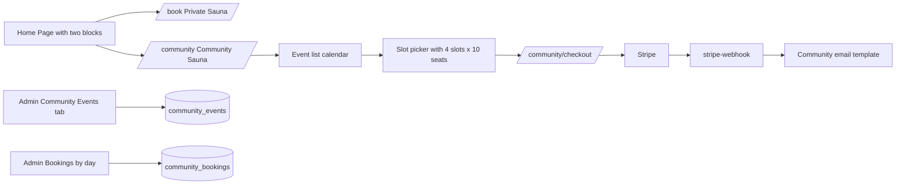

# Community Sauna — Admin Guide

A runbook for owners/admins: how the feature works end-to-end, how to add or
edit a Community Sauna event, how to smoke-test it, and a handful of DB
queries for troubleshooting.

---

## High-level flow

_Duplicated from `community-sauna-feature_410661c5.plan.md` for convenience._



**One-line summary:** an admin configures a weekly event series → events
materialize into `community_events` → the public `/community` page shows them
on a calendar → customers reserve seats per time slot → Stripe confirms →
rows in `community_bookings` become `confirmed` and both customer and owner
receive an email.

---

## Data model (what lives where)

| Table                    | Purpose                                                       |
| ------------------------ | ------------------------------------------------------------- |
| `community_event_series` | Recurring rule (e.g. Thursdays 4:30–8 PM). Admin edits once.  |
| `community_events`       | Concrete dates materialized from the series. Admin can edit/disable individual days. |
| `community_bookings`     | One row per reservation. Multiple rows allowed per `(event_date, slot_time)` up to `capacity_per_slot`. |
| `products` (`slug='community-sauna'`) | Canonical $29.95/person price. Changing this updates the public page. |

Private rentals still live in `bookings` — fully separate, nothing shared.

---

## 1. Add a Community Sauna event

You have two paths. **Use path A for the regular weekly cadence**, path B for
one-off overrides.

### Path A — Weekly series (recommended)

1. Sign in at `/admin/login`.
2. Go to **Admin → Settings → Community Events**.
3. Fill the **"Recurring series"** form:
   - **Day of week** — e.g. Thursday.
   - **Start time / End time** — e.g. `16:30` / `20:00`.
   - **Slot length (minutes)** — `60` (or 30 / 90).
   - **Capacity per slot** — `10` (people).
   - **Location** — pre-filled: `1921 W 10th Ave, Spokane, WA 99204`.
   - **Starts on / Ends on** — `Starts on` = today, leave `Ends on` empty for
     "forever".
   - **Active** — on.
4. Click **Save series**. You should see a toast "Series saved".
5. Click **Regenerate next 12 weeks**. This materializes concrete rows into
   `community_events` for the next 12 Thursdays. Already-existing rows are
   preserved (upsert).
6. Scroll to **"Upcoming events"** and verify the new dates are listed.

### Path B — One-off / override

Use this to add a special date outside the weekly series, or tweak one
specific Thursday (e.g. a holiday with different hours).

1. From the **Upcoming events** list in the same tab:
   - Click the pencil icon on any row to change `start_time`, `end_time`,
     `slot_minutes`, or `capacity_per_slot` for just that day.
   - Toggle **Active** off to cancel one day without deleting it.
   - Click the trash icon to remove a day entirely (safe — bookings live in
     `community_bookings` and are preserved; only the event definition is
     removed).

> Tip: customers see only `is_active = true` events (RLS), so toggling off is
> the safest way to "cancel" a date.

### Change the price

Community Sauna pricing is managed as a normal product:

1. **Admin → Settings → Products**.
2. Find **Community Sauna Seat** (`slug: community-sauna`).
3. Edit `base_price` and save.

No other config needed — the public page, checkout, and email all read this.

---

## 2. Test an event end-to-end

Use **Stripe test mode** (`pk_test_…` key in env) before going live.

### Public booking flow

1. Visit `/community` in an incognito window.
2. The calendar should highlight only Community Sauna days. Click one.
3. Location, hours, and price should render. Slot grid should show
   "X seats left" per slot.
4. Pick a slot, set quantity 1–N (not exceeding remaining), click
   **Reserve**.
5. On `/community/checkout`, fill:
   - Name, email, phone, optional notes, check terms.
   - Card: `4242 4242 4242 4242`, any future expiry, any CVC, any ZIP.
6. Click **Pay**. You should be redirected to
   `/community/confirmation/:id` with booking number `SAU-C-YYYYMMDD-XXXX`.
7. Check your inbox — customer confirmation email should arrive within ~30s.
   Check `OWNER_EMAIL` inbox for the owner notification.

### Admin verification

1. **Admin → Bookings → Community** tab:
   - The new booking appears under its `event_date`.
   - Per-slot roster shows the customer name and quantity.
   - Daily totals (bookings + revenue) update.
2. **Admin → Dashboard**: the "Community (7 days)" card increments.

### Capacity enforcement

1. Book enough seats to fill a slot (e.g. 10 × qty=1, or 1 × qty=10).
2. Reload `/community`, pick the same slot — it should be disabled with
   "Full".
3. Attempt to POST directly to `create-community-payment-intent` with an
   overflowing quantity — the edge function must reject with `409 capacity_exceeded`.

### 30-minute same-day cutoff

1. On the day of an event, advance system time (or wait) until 31 minutes
   past a slot start.
2. That slot should be disabled with a "Started" badge.
3. Server-side: `create-community-payment-intent` must reject with
   `400 slot_past_cutoff` if called with a past slot.

### Cancellation / failure paths

- **Cancel the Stripe payment** on the Elements page: the `pending` row in
  `community_bookings` remains but is never `confirmed`. You can clean it up
  with the "Cancel stale pending" query below.
- **`payment_intent.payment_failed`** webhook: the row flips to `cancelled`
  automatically.

---

## 3. DB query examples (Supabase SQL Editor)

All queries assume you're running as the service role (the SQL Editor is).

### 3.1 Inspect upcoming events

```sql
select
  id,
  event_date,
  start_time,
  end_time,
  slot_minutes,
  capacity_per_slot,
  is_active
from community_events
where event_date >= current_date
order by event_date asc;
```

### 3.2 Seat usage per slot for a given date

```sql
with slots as (
  select
    e.event_date,
    slot_start::time as slot_time,
    e.capacity_per_slot
  from community_events e,
    generate_series(
      (e.event_date || ' ' || e.start_time)::timestamp,
      (e.event_date || ' ' || e.end_time)::timestamp - (e.slot_minutes || ' minutes')::interval,
      (e.slot_minutes || ' minutes')::interval
    ) as slot_start
  where e.event_date = '2026-04-23'
)
select
  s.slot_time,
  s.capacity_per_slot,
  coalesce(sum(b.quantity) filter (where b.status != 'cancelled'), 0) as booked,
  s.capacity_per_slot
    - coalesce(sum(b.quantity) filter (where b.status != 'cancelled'), 0) as remaining
from slots s
left join community_bookings b
  on b.event_date = s.event_date
  and b.slot_time = s.slot_time
group by s.slot_time, s.capacity_per_slot
order by s.slot_time;
```

### 3.3 Roster for a specific event day

```sql
select
  slot_time,
  booking_number,
  customer_name,
  customer_email,
  quantity,
  status,
  total_amount,
  created_at
from community_bookings
where event_date = '2026-04-23'
  and status != 'cancelled'
order by slot_time, created_at;
```

### 3.4 Daily totals (admin dashboard rollup)

```sql
select
  event_date,
  count(*)        as bookings,
  sum(quantity)   as seats,
  sum(total_amount) filter (where status in ('confirmed','completed')) as revenue
from community_bookings
where event_date >= current_date
  and status != 'cancelled'
group by event_date
order by event_date;
```

### 3.5 Manually add an event (bypass UI)

```sql
insert into community_events (
  event_date, start_time, end_time, slot_minutes, capacity_per_slot, location
) values (
  '2026-05-07', '16:30', '20:00', 60, 10,
  '1921 W 10th Ave, Spokane, WA 99204'
)
on conflict (event_date) do update set
  start_time = excluded.start_time,
  end_time = excluded.end_time,
  slot_minutes = excluded.slot_minutes,
  capacity_per_slot = excluded.capacity_per_slot,
  location = excluded.location,
  is_active = true,
  updated_at = now();
```

### 3.6 Cancel / disable one event day (non-destructive)

```sql
update community_events
   set is_active = false,
       updated_at = now()
 where event_date = '2026-04-23';
```

### 3.7 Clean up stale `pending` bookings (> 1 hour old)

```sql
update community_bookings
   set status = 'cancelled',
       updated_at = now()
 where status = 'pending'
   and created_at < now() - interval '1 hour';
```

### 3.8 Adjust the community price

```sql
update products
   set base_price = 34.95,
       updated_at = now()
 where slug = 'community-sauna';
```

### 3.9 Spot-check RLS (run as anon / from the client)

```sql
-- Should return all *active* upcoming events
select event_date, start_time, end_time
from community_events
where is_active = true
  and event_date >= current_date
order by event_date;

-- Should return aggregate-like access to bookings
select event_date, slot_time, sum(quantity) as booked
from community_bookings
where status != 'cancelled'
group by event_date, slot_time
order by event_date, slot_time;
```

### 3.10 Refund / remove a booking (support ticket)

```sql
-- Prefer status update over delete so the audit trail and Stripe PI stay
-- paired.
update community_bookings
   set status = 'cancelled',
       notes  = coalesce(notes, '') || E'\n[refunded via Stripe dashboard]',
       updated_at = now()
 where booking_number = 'SAU-C-20260423-AB12';
```

Refund the Stripe PaymentIntent separately via the Stripe dashboard — the
webhook doesn't auto-refund.

---

## 4. Troubleshooting

| Symptom                                | Likely cause / fix                                                                                      |
| -------------------------------------- | ------------------------------------------------------------------------------------------------------- |
| Public calendar shows no days          | `community_events` empty or all `is_active=false`. Run "Regenerate next 12 weeks" in admin.             |
| Slot grid empty on a valid event       | `start_time >= end_time` or `slot_minutes = 0`. Edit the event.                                         |
| "Capacity exceeded" on first booking   | Stale `pending` rows inflating the sum. Run query 3.7.                                                  |
| Email not received                     | Check `RESEND_API_KEY`, `FROM_EMAIL` secrets in Supabase. Inspect `stripe-webhook` function logs.       |
| Webhook 400 from Stripe                | Secret mismatch. Re-set `STRIPE_WEBHOOK_SECRET` and redeploy.                                           |
| Admin can't save series                | RLS rejected — confirm the session is authenticated (auth cookie present).                              |
| Timezone drift on cutoff               | Edge function uses `America/Los_Angeles`. Verify the server's interpretation with query 3.2 + `now()`.  |

---

## 5. Commands cheat-sheet

```bash
# Apply migrations (from repo root)
NO_PROXY="*" supabase db push

# Deploy / redeploy edge functions relevant to this feature
NO_PROXY="*" supabase functions deploy create-community-payment-intent
NO_PROXY="*" supabase functions deploy stripe-webhook
NO_PROXY="*" supabase functions deploy expand-community-series

# Tail logs while testing a booking
NO_PROXY="*" supabase functions logs create-community-payment-intent --tail
NO_PROXY="*" supabase functions logs stripe-webhook --tail

# Run the unit tests that cover this feature
npm run test:unit
```

---

## 6. Related files

- Admin UI: `src/components/admin/CommunityEventsTab.tsx`,
  `src/components/admin/CommunityBookingsView.tsx`.
- Public UI: `src/pages/CommunitySaunaPage.tsx`,
  `src/pages/CommunityCheckoutPage.tsx`,
  `src/pages/CommunityConfirmationPage.tsx`.
- Pure helpers (tested): `src/lib/community.ts`
  (`src/lib/__tests__/community.test.ts`).
- Store (tested): `src/stores/communityBookingStore.ts`
  (`src/stores/__tests__/communityBookingStore.test.ts`).
- Edge functions: `supabase/functions/create-community-payment-intent/`,
  `supabase/functions/stripe-webhook/`,
  `supabase/functions/expand-community-series/`.
- Migrations: `supabase/migrations/012_community_events.sql` …
  `016_community_rls.sql`.
